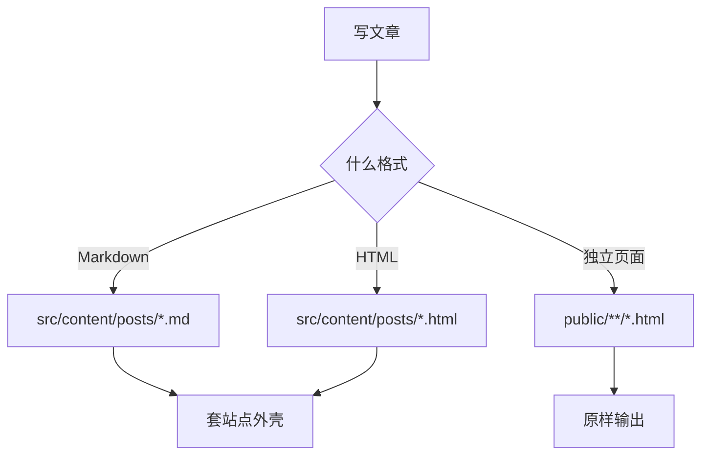
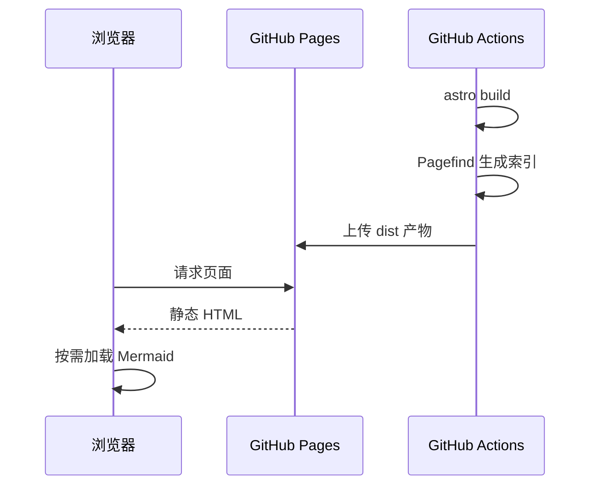

公式和图表走的是两条完全不同的路径，理解这一点有助于判断问题出在哪。

## 数学公式

公式由 KaTeX 在**构建期**渲染成静态 HTML，浏览器端不加载任何 JavaScript，所以不会有闪烁，也不影响页面性能。

行内公式用单个美元符号包裹，比如质能方程 $E = mc^2$，或者一个求和 $\sum_{i=1}^{n} i = \frac{n(n+1)}{2}$。

块级公式用两个美元符号：

$$
\int_{-\infty}^{\infty} e^{-x^2}\,\mathrm{d}x = \sqrt{\pi}
$$

矩阵、对齐等复杂结构也没问题：

$$
\begin{aligned}
\nabla \cdot \mathbf{E} &= \frac{\rho}{\varepsilon_0} \\
\nabla \cdot \mathbf{B} &= 0 \\
\nabla \times \mathbf{E} &= -\frac{\partial \mathbf{B}}{\partial t}
\end{aligned}
$$

$$
A = \begin{bmatrix} a_{11} & a_{12} \\ a_{21} & a_{22} \end{bmatrix}
$$

## 图表

Mermaid 走**客户端渲染**，而且是懒加载：只有页面上真的出现了图表，才会去下载 Mermaid 的运行时。不含图表的文章完全不受影响。

流程图：

时序图：

切换页面右上角的深浅色主题，图表会用保留下来的原始源码重新绘制，配色跟着主题走。

## 两者的排查思路

| 现象 | 大概率原因 |
| --- | --- |
| 公式变成裸的 `$...$` 文本 | remark-math / rehype-katex 没生效，检查 `markdown.processor` 是否切到了 unified |
| 公式排版错乱、字符错位 | katex 的渲染器与 CSS 版本不一致，检查 katex 是否被升到 0.16 以外 |
| 图表显示成代码块 | remark-mermaid 插件没生效，检查语言标记是否写作 `mermaid` |
| 图表切主题后不变色 | `data-mermaid-src` 丢失，无法重绘 |
